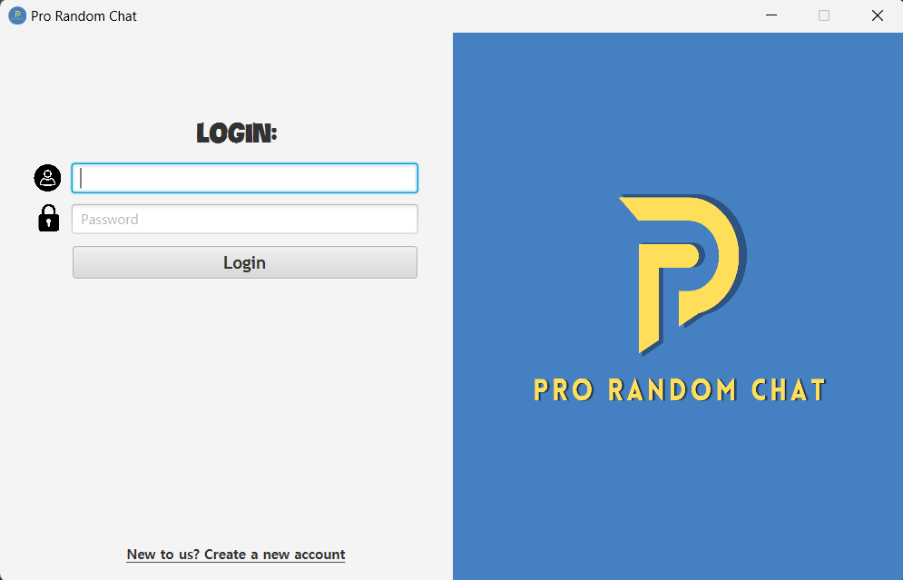
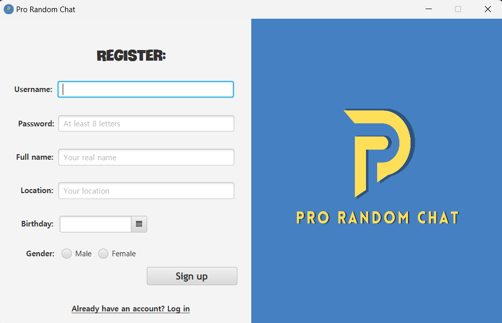
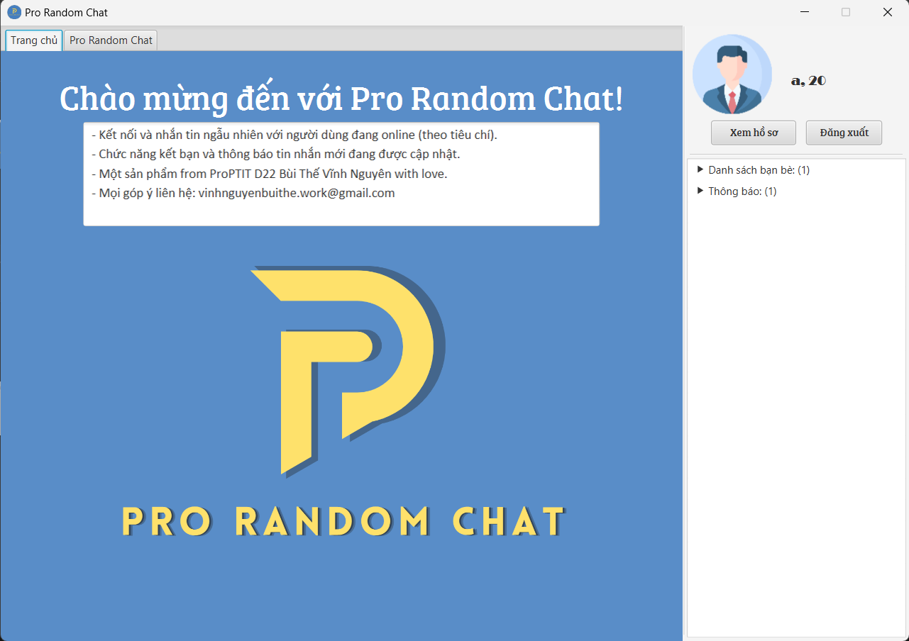
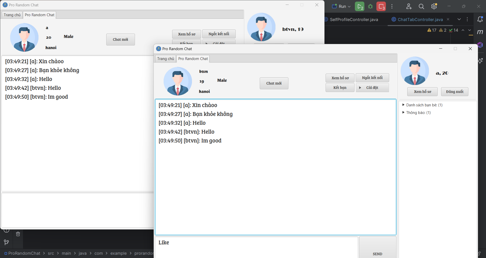
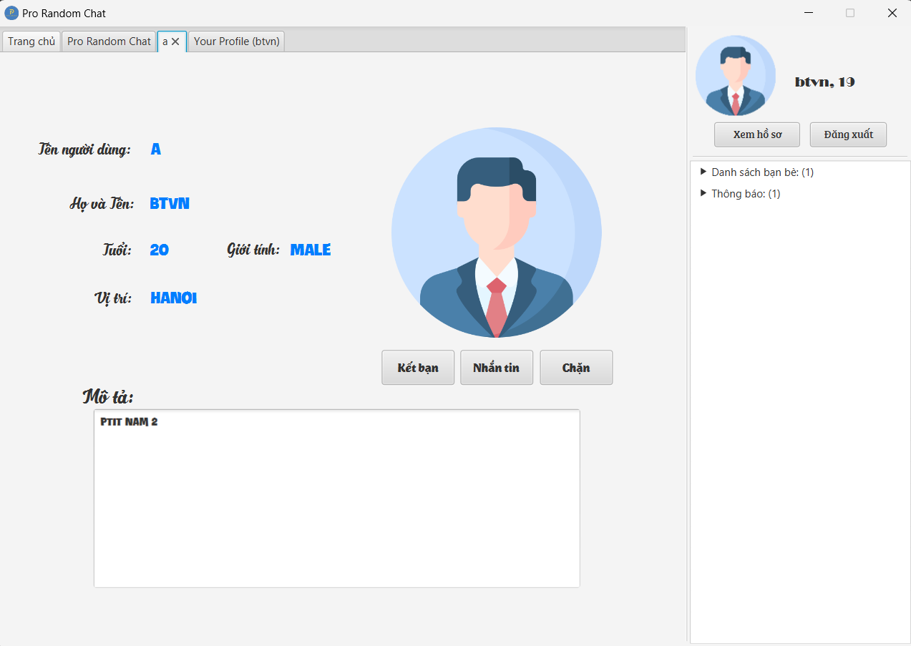
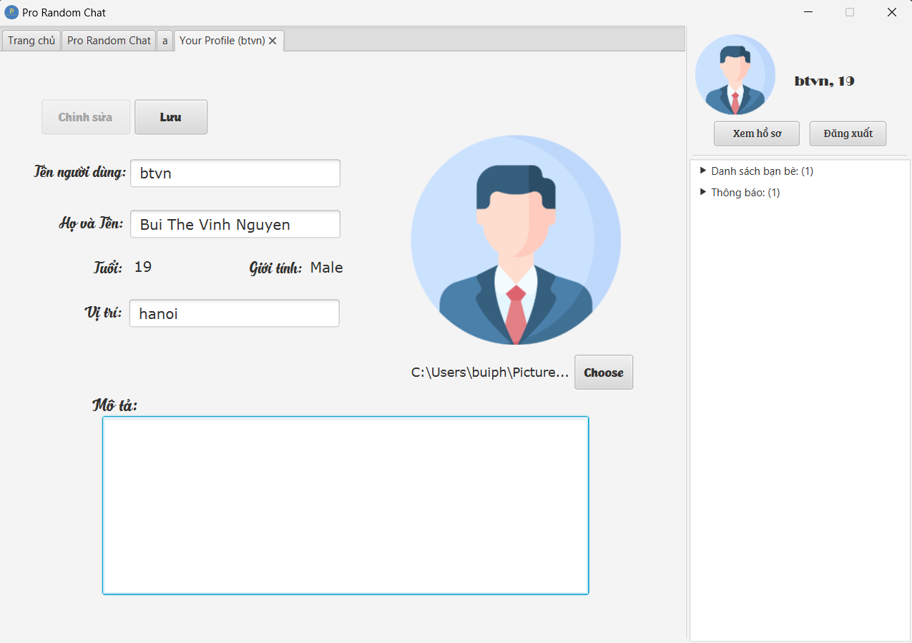
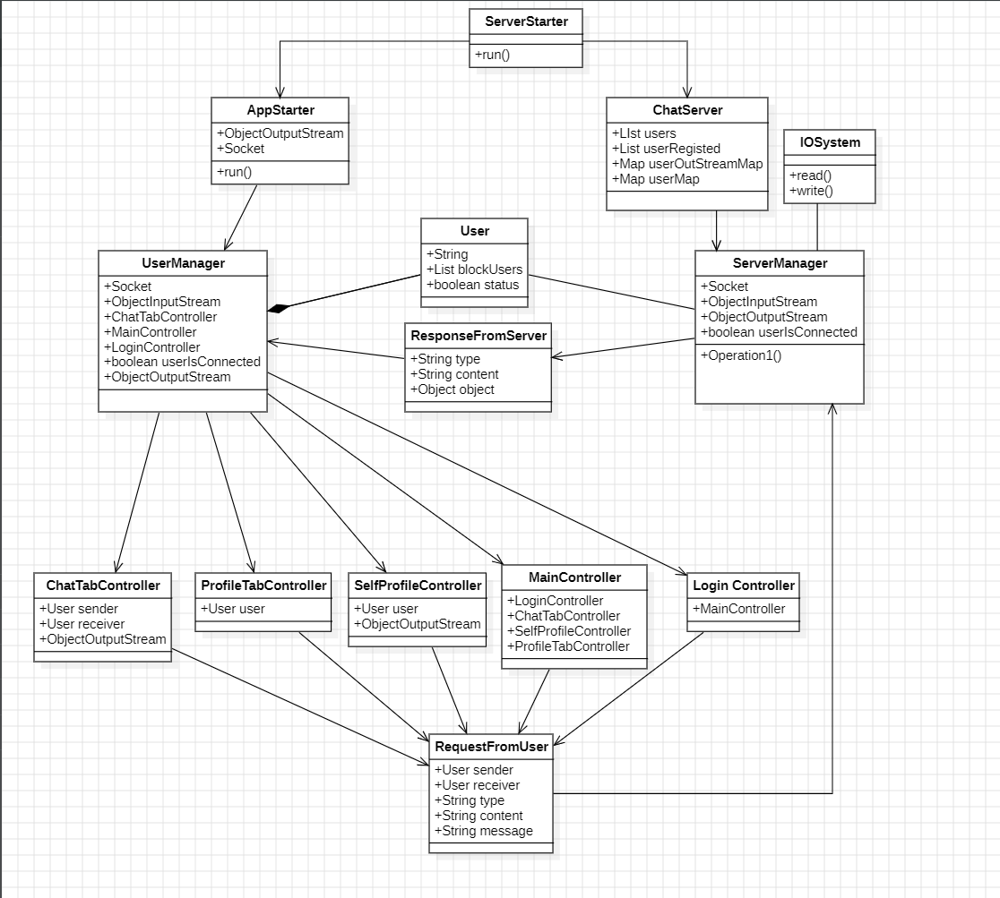
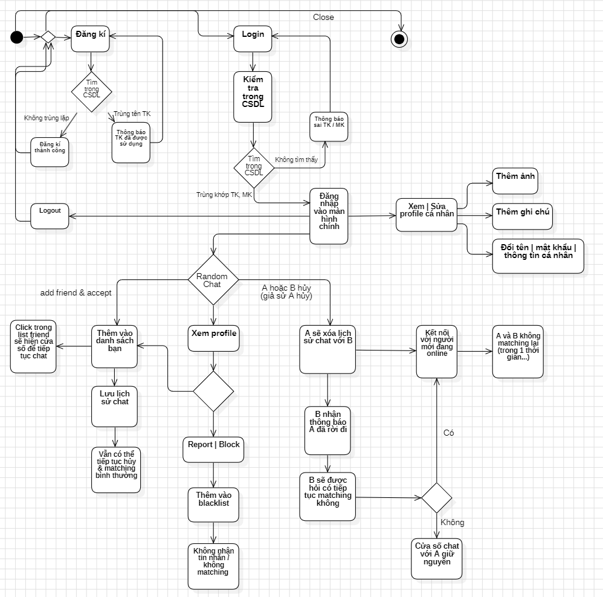

# Pro Random Chat

ProRandomChat is a chat application. Online and suitable users will randomly connect to each other to chat, add friend, ...

The project was done by [Bùi Thế Vĩnh Nguyên](https://github.com/NguyenBui256), in the course of Object Oriented Programming at [ProPTIT](https://proptit.com/).


## Tech Stack

- [Java](https://www.java.com/en/) 


## Installation

- Clone the repo
- Open: Product \ GameLauncher (Batch File). 
- Enjoy the game

## Demo

### **Gameplay video:** 
### **Images**:

 

 
 
 
 


## Usage

- Project Structure

```bash

├── src
│   ├── Audio
│   ├── Classes
│   │   │   ├── Ingame.java
│   │   │   ├── Main.java
│   │   │   ├── Starting.java
│   │   │   ├── Leader.java
│   │   │   ├── Board.java
│   │   │   ├── Settings.java
│   ├── Data
│   │   │   ├── saveLoadFunction.java
│   │   │   ├── leaderBoard.txt


```

## UML
### Class Diagram:


### Activity Diagram:


## Contributing

Pull requests are welcome. For major changes, please open an issue first
to discuss what you would like to change.

Please make sure to update tests as appropriate.

## License

[MIT](https://choosealicense.com/licenses/mit/)

